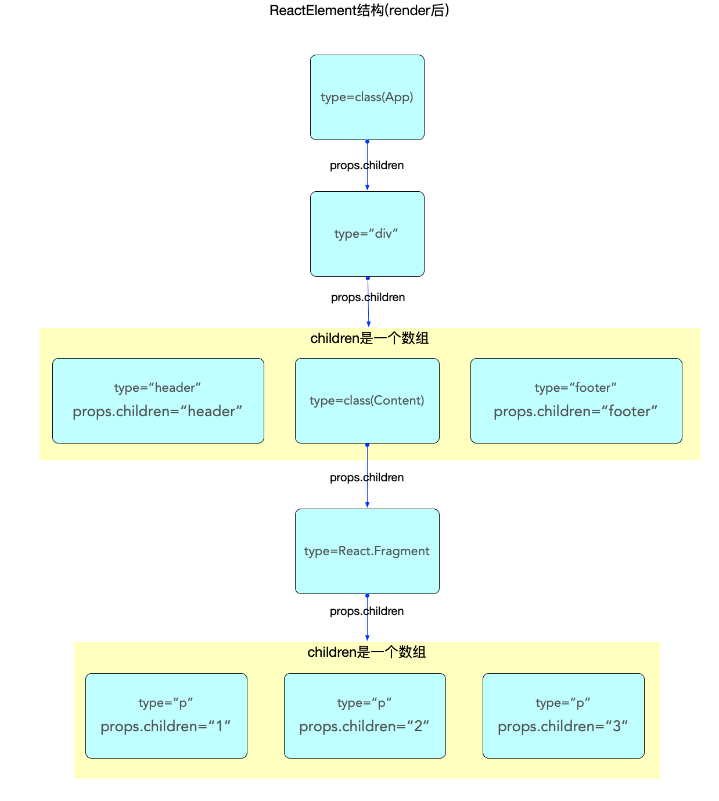
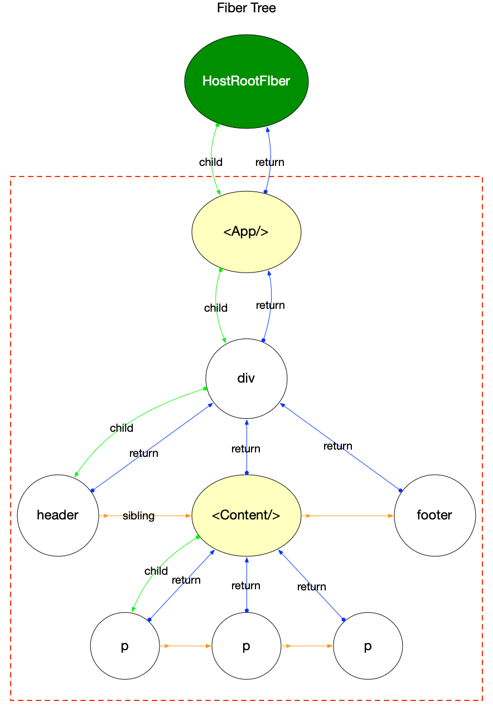
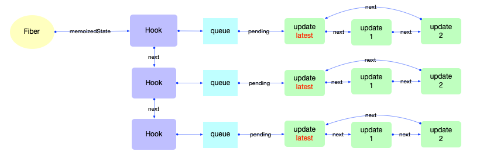
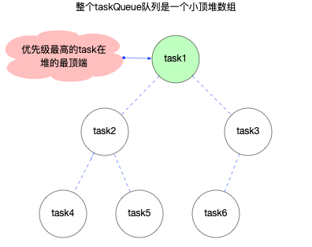

## 1. ReactElement 对象

所有采用 `jsx` 语法书写的节点，都会被编译器转换，最终会以 `React.createElement(...)` 的方式，创建出来一个与之对应的 `ReactElement` 对象

ReactElement 对象的数据结构如下：

```ts
export type ReactElement = {
  // 用于辨别 ReactElement 对象
  $typeof: any,

  // 内部属性
  type: any, // 表明其种类
  key: any,
  ref: any,
  props: any,

  // ReactFiber 记录创建本对象的Fiber节点, 还未与 Fiber 树关联之前, 该属性为 null
  _owner: any,

  // __DEV__ dev 环境下的一些额外信息, 如文件路径, 文件名, 行列信息等
  _store: { validated: boolean, ... },
  _self: React$Element<any>,
  _shadowChildren: any,
  _source: Source,
}
```

其中有 2 个属性需要注意：

- `key` 属性在 **reconciler 阶段**会用到，目前只需要知道所有的 `ReactElement` 对象都有 `key` 属性（且其默认值是 `null`，这点十分重要，在 **diff 算法**中会使用到）
- `type` 属性决定了节点的种类
  - 它的值可以是**字符串**（代表 `div`，`span` 等 **dom 节点**），函数（代表 `function`，`class` 等节点），或者 `react` 内部定义的节点类型（`portal`，`context`，`fragment` 等）
  - 在 `reconciler` 阶段，会根据 `type` 执行不同的逻辑
    - 如 `type` 是一个字符串类型，则直接使用
    - 如 `type` 是一个 `ReactComponent` 类型，则会调用其 `render` 方法获取子节点
    - 如 `type` 是一个 `function` 类型，则会调用该方法获取子节点

### 1.1 ReactComponent 对象

对于 `ReactElement` 来讲，`ReactComponent` 仅仅是诸多 `type` 类型中的一种

一个简单的示例，通过查看编译后的代码来说明：

```js
class App extends React.Component {
  render() {
    return (
      <div className="app">
        <header>header</header>
        <Content />
        <footer>footer</footer>
      </div>
    )
  }
}

class Content extends React.Component {
  render() {
    return (
      <React.Fragment>
        <p>1</p>
        <p>2</p>
        <p>3</p>
      </React.Fragment>
    )
  }
}

export default App
```

编译之后的代码

```js
class App_App extends react_default.a.Component {
  render() {
    return /*#__PURE__*/ react_default.a.createElement(
      'div',
      {
        className: 'app',
      } /*#__PURE__*/,
      react_default.a.createElement('header', null, 'header') /*#__PURE__*/,

      // 此处直接将Content传入, 是一个指针传递
      react_default.a.createElement(App_Content, null) /*#__PURE__*/,
      react_default.a.createElement('footer', null, 'footer')
    )
  }
}
class App_Content extends react_default.a.Component {
  render() {
    return /*#__PURE__*/ react_default.a.createElement(
      react_default.a.Fragment,
      null /*#__PURE__*/,
      react_default.a.createElement('p', null, '1'),
      /*#__PURE__*/

      react_default.a.createElement('p', null, '2'),
      /*#__PURE__*/

      react_default.a.createElement('p', null, '3')
    )
  }
}
```

`createElement` 函数的第一个参数将作为创建 `ReactElement` 的 `type`。可以看到 `Content` 这个变量被编译器命名为 `App_Content`，并作为第一个参数（引用传递），传入了 `createElement`

但是由于 `ReactComponent` 是 `class` 类型，自有它的特殊性：

- `ReactComponent` 是 `class` 类型，继承父类 `Component`，拥有特殊的方法（`setState`，`forceUpdate`）和特殊的属性（`context`，`updater` 等）
- 在 **reconciler 阶段**，会依据 `ReactElement` 对象的特征，生成对应的 `fiber` 节点。当识别到 `ReactElement` 对象是 `class` 类型的时候，会触发 `ReactComponent` 对象的**生命周期**，并调用其 `render` 方法，生成 `ReactElement` 子节点

> 如果在 `function` 类型的组件中没有使用 `Hook`，如：`useState`，`useEffect` 等，在 **reconciler 阶段**所有有关 `Hook` 的处理都会略过，最后调用该 `function` 拿到子节点 `ReactElement`

### 1.2 ReactElement 内存结构

**reconciler 阶段**完成之后才会形成完整的结构，如下：



特别说明：

- `class` 和 `function` 类型的组件，其子节点是在 `render` 之后（**reconciler 阶段**）才生成的。此处只是单独表示 `ReactElement` 的数据结构
- 父级对象和子级对象之间是通过 `props.children` 属性进行关联的（与 **fiber 树**不同）
- `ReactElement` 虽然不能算是一个严格的树，也不能算是一个严格的链表。它的生成过程是自顶向下的，是所有组件节点的总和
- `ReactElement` 链表和 `fiber` 树是以 `props.children` 为单位先后交替生成的，当 ReactElement 链表构造完毕，`fiber` 树也随后构造完毕
- **reconciler 阶段**会根据 `ReactElement` 的类型生成对应的 `fiber` 节点（**不是一一对应，比如：`Fragment` 类型的组件在生成 `fiber` 节点的时候会略过**）

## 2. （wip）Fiber 对象

```ts
// 一个 Fiber 对象代表一个即将渲染或者已经渲染的组件(ReactElement), 一个组件可能对应两个fiber(current 和 WorkInProgress)
// 单个属性的解释在后文(在注释中无法添加超链接)
export type Fiber = {
  tag: WorkTag,
  key: null | string,
  elementType: any,
  type: any,
  stateNode: any,
  return: Fiber | null,
  child: Fiber | null,
  sibling: Fiber | null,
  index: number,
  ref:
    | null
    | (((handle: mixed) => void) & { _stringRef: ?string, ... })
    | RefObject,
  pendingProps: any, // 从 ReactElement 对象传入的 props 用于和 fiber.memoizedProps 比较可以得出属性是否变动
  memoizedProps: any, // 上一次生成子节点时用到的属性, 生成子节点之后保持在内存中
  updateQueue: mixed, // 存储state更新的队列, 当前节点的state改动之后, 都会创建一个update对象添加到这个队列中.
  memoizedState: any, // 用于输出的state, 最终渲染所使用的state
  dependencies: Dependencies | null, // 该fiber节点所依赖的(contexts, events)等
  mode: TypeOfMode, // 二进制位Bitfield,继承至父节点,影响本fiber节点及其子树中所有节点. 与react应用的运行模式有关(有ConcurrentMode, BlockingMode, NoMode等选项).

  // Effect 副作用相关
  flags: Flags, // 标志位
  subtreeFlags: Flags, //替代16.x版本中的 firstEffect, nextEffect. 当设置了 enableNewReconciler=true才会启用
  deletions: Array<Fiber> | null, // 存储将要被删除的子节点. 当设置了 enableNewReconciler=true才会启用

  nextEffect: Fiber | null, // 单向链表, 指向下一个有副作用的fiber节点
  firstEffect: Fiber | null, // 指向副作用链表中的第一个fiber节点
  lastEffect: Fiber | null, // 指向副作用链表中的最后一个fiber节点

  // 优先级相关
  lanes: Lanes, // 本fiber节点的优先级
  childLanes: Lanes, // 子节点的优先级
  alternate: Fiber | null, // 指向内存中的另一个fiber, 每个被更新过fiber节点在内存中都是成对出现(current和workInProgress)

  // 性能统计相关(开启enableProfilerTimer后才会统计)
  // react-dev-tool会根据这些时间统计来评估性能
  actualDuration?: number, // 本次更新过程, 本节点以及子树所消耗的总时间
  actualStartTime?: number, // 标记本fiber节点开始构建的时间
  selfBaseDuration?: number, // 用于最近一次生成本fiber节点所消耗的时间
  treeBaseDuration?: number, // 生成子树所消耗的时间的总和
};
```



图表解释：

- 这里的 `fiber` 树只是为了和上文中的 `ReactElement` 链表对照，所以只用观察红色虚线框内的节点。根节点 `HostRootFiber`
- 其中 `<App/>`，`<Content/>` 为 `ClassComponent` 类型的 `fiber` 节点，其余节点都是普通 `HostComponent` 类型节点
- `<Content/>` 的子节点在 `ReactElement` 链表中是 `React.Fragment`，但是在 `fiber` 树中 `React.Fragment` 并没有与之对应的 `fiber` 节点（**reconciler 阶段**对此类型节点做了单独处理，所以 `ReactElement` 节点和 `fiber` 节点不是一对一匹配）

### 2.1 Update 对象

在 `fiber` 对象中有一个属性 `fiber.updateQueue`，是一个链式队列

`Update` 对象的数据结构，如下：

```ts
export type Update<State> = {
  // 发起update事件的时间(17.0.2中作为临时字段, 即将移出)
  eventTime: number
  // update所属的优先级
  lane: Lane

  tag: 0 | 1 | 2 | 3
  // 载荷, 根据场景可以设置成一个回调函数或者对象
  payload: any
  // 回调函数
  callback: (() => mixed) | null
  // 指向链表中的下一个, 由于 UpdateQueue 是一个环形链表, 最后一个 update.next 指向第一个 update 对象
  next: Update<State> | null
}

// =============== UpdateQueue ==============
type SharedQueue<State> = {
  pending: Update<State> | null
}

export type UpdateQueue<State> = {
  baseState: State
  firstBaseUpdate: Update<State> | null
  lastBaseUpdate: Update<State> | null
  shared: SharedQueue<State>
  effects: Array<Update<State>> | null
}
```

属性解释：

- `UpdateQueue`
  - `baseState`：表示此队列的基础 `state`
  - `firstBaseUpdate`：指向基础队列的**队首**
  - `lastBaseUpdate`：指向基础队列的**队尾**
  - `shared`：共享队列
  - `effects`：用于保存有 `callback` 回调函数的 `update 对象`，在 `commit` 之后, 会依次调用这里的回调函数
- `SharedQueue`
  - `pending`：指向即将输入的 `update` 队列。在 `class` 组件中调用 `setState()` 之后，会将新的 `update` 对象添加到这个队列中来
- `Update`
  - `eventTime`：发起 `update` 事件的时间（17.0.2 中作为临时字段，即将移出）
  - `lane`：`update` 所属的优先级
  - `tag`：表示 `update` 种类，共 4 种：`UpdateState`，`ReplaceState`，`ForceUpdate`，`CaptureUpdate`
  - `payload`：载荷，`update` 对象真正需要更新的数据，可以设置成一个回调函数或者对象
  - `callback`：回调函数。`commit` 完成之后会调用
  - `next`：指向链表中的下一个，由于 `UpdateQueue` 是一个环形链表，最后一个 `update`。`next` 指向第一个 `update` 对象

`updateQueue` 是 `fiber` 对象的一个属性，所以不能脱离 `fiber` 存在。它们之间数据结构和引用关系如下：


### 2.2 Hook 对象

`Hook` 用于 `function` 组件中, 能够保持 `function` 组件的状态

其结构如下：

```ts
export type Hook = {
  memoizedState: any
  baseState: any
  baseQueue: Update<any, any> | null
  queue: UpdateQueue<any, any> | null
  next: Hook | null
}

type Update<S, A> = {
  lane: Lane
  action: A
  eagerReducer: ((S, A) => S) | null
  eagerState: S | null
  next: Update<S, A>
  priority?: ReactPriorityLevel
}

type UpdateQueue<S, A> = {
  pending: Update<S, A> | null
  dispatch: ((A) => mixed) | null
  lastRenderedReducer: ((S, A) => S) | null
  lastRenderedState: S | null
}
```

属性解释:

- `Hook`
  - `memoizedState`：内存状态，用于输出成最终的 `fiber 树`
  - `baseState`：基础状态，当 `Hook.queue` 更新过后，`baseState` 也会更新
  - `baseQueue`：基础状态队列，在 **reconciler 阶段**会辅助状态合并
  - `queue`：指向一个 `Update 队列`
  - `next`：指向该 `function` 组件的下一个 `Hook` 对象，使得多个 `Hook` 之间也构成了一个链
- `Hook.queue` 和 `Hook.baseQueue` 是为了保证 `Hook` 对象能够顺利更新，与上文 `fiber.updateQueue` 中的 `UpdateQueue` 和 `Update` 是**不一样**的

所以 `Hook` 也不能脱离 `fiber` 而存在，它们之间的引用关系如下：



## 3. Task 对象

`scheduler` 包负责调度，在内部维护一个任务队列（`taskQueue`）。这个队列是一个最小堆数组，其中存储了 `task` 对象。其结构如下：

```ts
var newTask = {
  id: taskIdCounter++,
  callback,
  priorityLevel,
  startTime,
  expirationTime,
  sortIndex: -1,
}
```

属性解释:

- `id`：唯一标识
- `callback`：`task` 最核心的字段，指向 `react-reconciler` 包所提供的回调函数
- `priorityLevel`：优先级
- `startTime`：一个时间戳，代表 `task` 的开始时间（创建时间 + 延时时间）
- `expirationTime`：过期时间
- `sortIndex`：控制 `task` 在队列中的次序，值越小的越靠前

注意 `task` 中没有 `next` 属性, 它不是一个链表，其顺序是通过堆排序来实现的（**小顶堆数组**，始终保证数组中的第一个 `task` 对象优先级最高）

> 任务队列是动态的任务池，数据形式上就是一个数组。当然可以根据优先级进行排序，也就是 `Array.sort`，当有新任务入队后，先排序，然后找出优先级最高的任务执行。但是 `Array.sort` 的平均时间复杂度是 `O(nlogn)`，并不是最好的解决方案
>
> [堆排序](https://juejin.cn/post/7115981649266868261#heading-0)
> 堆是一种非线性结构，可以把堆看作一棵二叉树，也可以看作一个数组，即：堆就是利用完全二叉树结构来维护的一维数组
> 堆可以分为大顶堆和小顶堆
>
> - 大顶堆：每个结点的值都大于或等于其左右孩子结点的值。
> - 小顶堆：每个结点的值都小于或等于其左右孩子结点的值。
>
> 如果是排序，求升序用大顶堆，求降序用小顶堆
>
> 初始化建堆时间复杂度：O(n)
> 取出最大/小元素后修改堆：O(nlogn)


