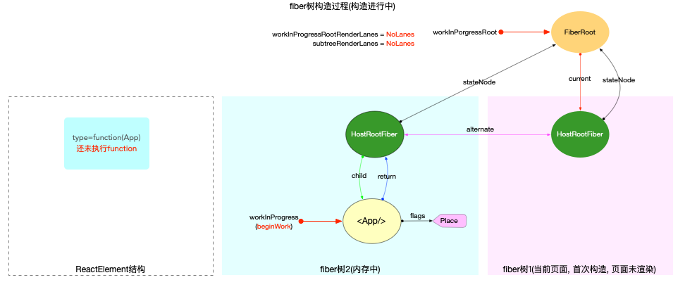
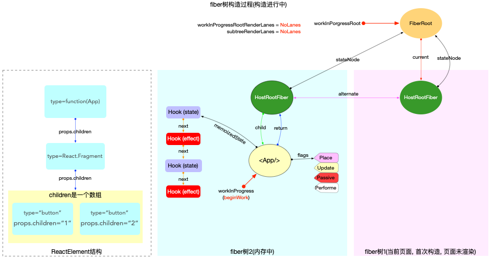
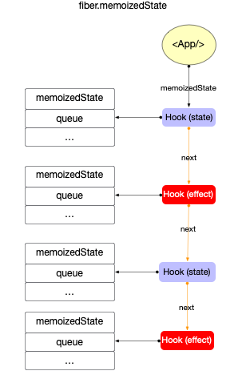
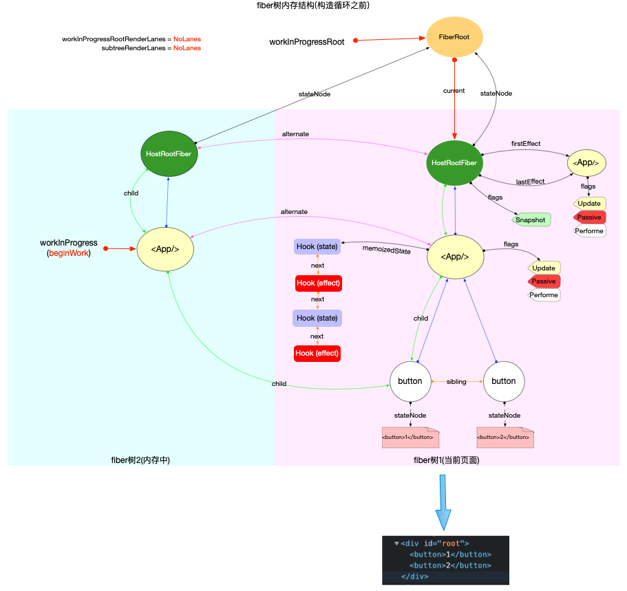
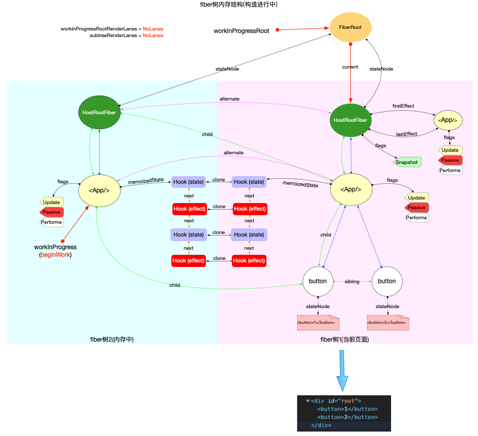
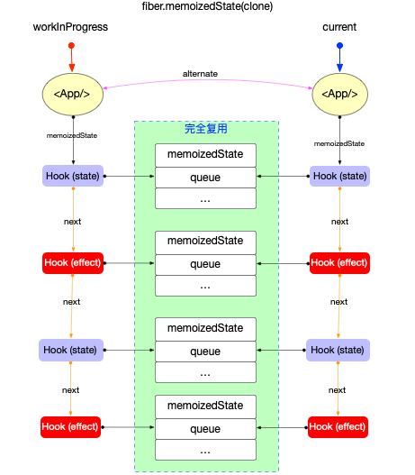

## 1. 背景

### 1.1 什么需要 Hook？

- **组件间的状态难以复用：** 在 hook 出现之前的状态复用有 Mixins、props 和 HOC（高阶组件）。其中，props、HOC（高阶组件）虽然能解决状态复用问题，但是组件会形成“嵌套地狱”。而 Minxins 存在以下问题：可能会相互依赖，相互耦合，不利于代码维护；不同的 Mixins 中的方法可能会相互冲突；Mixins 非常多时，组件是可以感知到的，甚至还要为其做相关处理，这样会给代码造成滚雪球的复杂性。
- **复杂组件难以理解：** classComponent 的生命周期中充斥各种状态逻辑和副作用，变成了“面向生命周期变成”。
- **难以理解的 class：** 除了代码复用和代码管理会遇到困难外，class 是学习 React 的一大屏障，必须去理解 JavaScript 中  this  的工作方式，这与其他语言存在巨大差异。还不能忘记绑定事件处理器。如果不使用  ES2022 public class fields，这些代码非常冗余。此外，class 也给目前的工具带来了一些问题，例如，组件预编译技术会在 class 中遇到优化失效的 case；class 不能很好的压缩；class 在热重载会出现不稳定的情况。

### 1.2 hook 是什么？

React 的特征是 UI=f(data)，一切皆组件、声明式编程。那么，既然是 UI=f(data)，data（数据）通过 function 来驱动 UI 视图变化。在业务中，你不能简单只展示，也需交互，交互就会更新状态，React 是通过 setState 来改变状态。但这仅限于类组件，所以在 Hooks 出现之前，函数式组件用来渲染组件（也称它为木偶组件），类组件用来控制状态。

React Hooks 是 React 16.8 推出的新特性。它可以让你在不编写 class 的情况下使用 state 以及其他的 React 特性

Hook 主要是为了解决以下问题：

- 无 class 的复杂性；
- 无生命周期的困扰；
- 优雅复用；
- 对齐 class 组件已经具备的能力。

> [Hook 会因为在渲染时创建函数而变慢吗？](https://zh-hans.legacy.reactjs.org/docs/hooks-faq.html#are-hooks-slow-because-of-creating-functions-in-render)
> 不会。在现代浏览器中，闭包和类的原始性能只有在极端场景下才会有明显的差别。
> 除此之外，可以认为 Hook 的设计在某些方面更加高效：
>
> - Hook 避免了 class 需要的额外开支，像是创建类实例和在构造函数中绑定事件处理器的成本。
> - 符合语言习惯的代码在使用 Hook 时不需要很深的组件树嵌套。这个现象在使用高阶组件、render props、和 context 的代码库中非常普遍。组件树小了，React 的工作量也随之减少。
>   传统上认为，在 React 中使用内联函数对性能的影响，与每次渲染都传递新的回调会如何破坏子组件的 shouldComponentUpdate 优化有关。Hook 从三个方面解决了这个问题。
> - useCallback Hook 允许你在重新渲染之间保持对相同的回调引用以使得 shouldComponentUpdate 继续工作：
> - useMemo Hook 使得控制具体子节点何时更新变得更容易，减少了对纯组件的需要。
> - 最后，useReducer Hook 减少了对深层传递回调的依赖，正如下面解释的那样。

## 2. Hook 和 Fiber

从 fiber 视角, 状态和副作用相关的属性如下：

```ts
export type Fiber = {
  // 1. fiber节点自身状态相关
  pendingProps: any
  memoizedProps: any
  updateQueue: mixed
  memoizedState: any

  // 2. fiber节点副作用(Effect)相关
  flags: Flags
  nextEffect: Fiber | null
  firstEffect: Fiber | null
  lastEffect: Fiber | null
}
```

## 3. Hook 的数据结构

```ts
type Update<S, A> = {
  lane: Lane
  action: A
  eagerReducer: ((S, A) => S) | null
  eagerState: S | null
  next: Update<S, A>
  priority?: ReactPriorityLevel
}

type UpdateQueue<S, A> = {
  pending: Update<S, A> | null
  dispatch: ((A) => mixed) | null
  lastRenderedReducer: ((S, A) => S) | null
  lastRenderedState: S | null
}

export type Hook = {
  memoizedState: any // 当前状态
  baseState: any // 基状态
  baseQueue: Update<any, any> | null // 基队列
  queue: UpdateQueue<any, any> | null // 更新队列
  next: Hook | null // next指针
}
```

> 从定义来看, Hook 对象共有 5 个属性（有关这些属性的应用, 将在 Hook 原理(状态)章节中具体分析）:
>
> - `hook.memoizedState`：保持在内存中的局部状态。
> - `hook.baseState`：hook.baseQueue 中所有 update 对象合并之后的状态。
> - `hook.baseQueue`：存储 update 对象的环形链表, 只包括高于本次渲染优先级的 update 对象。
> - `hook.queue`：存储 update 对象的 **环形链表**, 包括所有优先级的 update 对象。
> - `hook.next`：next 指针, 指向链表中的下一个 hook。

所以 Hook 是一个链表, 单个 Hook 拥有自己的状态 `hook.memoizedState` 和自己的更新队列 `hook.queue`。


> 其中 `hook.queue` 与 `fiber.updateQueue` 虽然都是 update 环形链表, 尽管 update 对象的数据结构与处理方式都高度相似, 但是这 2 个队列中的 update 对象是完全独立的。`hook.queue` 只作用于 hook 对象的状态维护, 切勿与 `fiber.updateQueue` 混淆。

## 4. Hook 的分类

官网上已经将其分为了 2 个类别, 状态 Hook（`State Hook`）, 和副作用 Hook（`Effect Hook`）.

```ts
export type HookType =
  | 'useState'
  | 'useReducer'
  | 'useContext'
  | 'useRef'
  | 'useEffect'
  | 'useLayoutEffect'
  | 'useCallback'
  | 'useMemo'
  | 'useImperativeHandle'
  | 'useDebugValue'
  | 'useDeferredValue'
  | 'useTransition'
  | 'useMutableSource'
  | 'useOpaqueIdentifier'
```

### 4.1 状态 Hook

狭义上讲，`useState`，`useReducer` 可以在 `function` 组件添加内部的 `state`, 且 `useState` 实际上是 `useReducer` 的简易封装, 是一个最特殊(简单)的 `useReducer`. 所以将 `useState`，`useReducer` 称为状态 Hook（`State Hook`）。

广义上讲, 只要能实现数据持久化且没有副作用的 Hook, 均可以视为状态 Hook（`State Hook`）, 所以还包括 `useContext`，`useRef`，`useCallback`，`useMemo` 等。这类 Hook 内部没有使用 `useState`（或 `useReducer`）, 但是它们也能实现多次 render 时, 保持其初始值不变（即数据持久化）且没有任何副作用。

得益于双缓冲技术（double buffering）, 在多次 render 时, 以 fiber 为载体, 保证复用同一个 Hook 对象, 进而实现数据持久化. 具体实现细节, 在 Hook 原理(状态)章节中讨论.

### 4.2 副作用 Hook

副作用 Hook 则会修改 `fiber.flags`。

> 在 `performUnitOfWork` -> `completeWork` 阶段，所有存在副作用的 fiber 节点，都会被添加到父节点的副作用队列后，最后在 `commitRoot` 阶段处理这些副作用节点。

```ts
// 使用 useEffect 时, 需要传入一个副作用回调函数
// 在 fiber 树构造完成之后，commitRoot 阶段会处理这些副作用回调
useEffect(() => {
  console.log('这是一个副作用回调函数')
}, [])
```

在 react 内部，`useEffect` 就是最标准的副作用 Hook。其他比如 `useLayoutEffect` 以及自定义 Hook，如果要实现副作用，必须直接或间接的调用 `useEffect`。

## 4. 执行流程

举个例子：

```jsx
import { useState, useEffect } from 'react'
export default function App() {
  // 1. useState
  const [a, setA] = useState(1)
  // 2. useEffect
  useEffect(() => {
    console.log(`effect 1 created`)
  })
  // 3. useState
  const [b] = useState(2)
  // 4. useEffect
  useEffect(() => {
    console.log(`effect 2 created`)
  })
  return (
    <>
      <button onClick={() => setA(a + 1)}>{a}</button>
      <button>{b}</button>
    </>
  )
}
```

### 4.1 前置工作

#### 4.1.1 Fiber 关联 Hook

```ts
function beginWork(
  current: Fiber | null,
  workInProgress: Fiber,
  renderLanes: Lanes
): Fiber | null {
  const updateLanes = workInProgress.lanes
  switch (workInProgress.tag) {
    // 只保留 FunctionComponent 相关:
    case FunctionComponent: {
      const Component = workInProgress.type
      const unresolvedProps = workInProgress.pendingProps
      const resolvedProps =
        workInProgress.elementType === Component
          ? unresolvedProps
          : resolveDefaultProps(Component, unresolvedProps)
      return updateFunctionComponent(
        current,
        workInProgress,
        Component,
        resolvedProps,
        renderLanes
      )
    }
  }
}

function updateFunctionComponent(
  current,
  workInProgress,
  Component,
  nextProps: any,
  renderLanes
) {
  // ...省略无关代码
  let context
  let nextChildren
  prepareToReadContext(workInProgress, renderLanes)

  // 进入 Hooks 相关逻辑, 最后返回下级 ReactElement 对象
  nextChildren = renderWithHooks(
    current,
    workInProgress,
    Component,
    nextProps,
    context,
    renderLanes
  )
  // 进入 reconcile 函数, 生成下级 fiber 节点
  reconcileChildren(current, workInProgress, nextChildren, renderLanes)
  // 返回下级 fiber 节点
  return workInProgress.child
}
```

在 `updateFunctionComponent` 函数中调用了 `renderWithHooks`，至此 Fiber 与 Hook 产生了关联。

#### 4.1.2 renderWithHooks

```ts
export function renderWithHooks<Props, SecondArg>(
  current: Fiber | null,
  workInProgress: Fiber,
  Component: (p: Props, arg: SecondArg) => any,
  props: Props,
  secondArg: SecondArg,
  nextRenderLanes: Lanes,
): any {
  // step1: 设置全局变量，标记渲染优先级和当前 fiber，清除当前 fiber 的遗留状态
  // 当前渲染优先级
  renderLanes = nextRenderLanes;
  // 当前fiber节点, 也就是function组件对应的fiber节点
  currentlyRenderingFiber = workInProgress;

  // 清除当前fiber的遗留状态
  workInProgress.memoizedState = null;
  workInProgress.updateQueue = null;
  workInProgress.lanes = NoLanes;

  // step2: 构造出 Hooks 链表，最后生成子级 ReactElement 对象（children）
  // 指定 dispatcher，区分 mount 和 update
  ReactCurrentDispatcher.current =
    current === null || current.memoizedState === null
      ? HooksDispatcherOnMount
      : HooksDispatcherOnUpdate;
  // 执行 function 函数，其中进行分析Hooks的使用
  let children = Component(props, secondArg);

  // step3: 重置全局变量，返回 children
  // 执行 function 之后，还原被修改的全局变量，不影响下一次调用
  renderLanes = NoLanes;
  currentlyRenderingFiber = (null: any);
  currentHook = null;

  workInProgressHook = null;
  didScheduleRenderPhaseUpdate = false;

  return children;
}
```

> 1. 设置全局变量，标记渲染优先级和当前 fiber，清除当前 fiber 的遗留状态。
> 2. 构造出 Hooks 链表，最后生成子级 ReactElement 对象（children）。
> 3. 重置全局变量，返回 children。
>    - 为了保证不同的 functionComponent 节点在调用时 renderWithHooks 互不影响，所以退出时重置全局变量。

### 4.2 执行中

初次渲染时，逻辑执行到 `performUnitOfWork` -> `beginWork` -> `updateFunctionComponent` -> `renderWithHooks` 前，内存结构如下：



`useState`, `useEffect` 在 fiber 初次构造时分别对应 `mountState` 和 `mountEffectImpl`。

```ts
function mountState<S>(
  initialState: (() => S) | S
): [S, Dispatch<BasicStateAction<S>>] {
  const hook = mountWorkInProgressHook()
  // ...省略
  return [hook.memoizedState, dispatch]
}

function mountEffectImpl(fiberFlags, hookFlags, create, deps): void {
  const hook = mountWorkInProgressHook()
  // ...省略
}
```

> 无论 `useState`, `useEffect`, 内部都通过 `mountWorkInProgressHook` 创建一个 hook。

#### 4.2.1 mountWorkInProgressHook

```ts
function mountWorkInProgressHook(): Hook {
  const hook: Hook = {
    memoizedState: null,

    baseState: null,
    baseQueue: null,
    queue: null,

    next: null,
  }

  if (workInProgressHook === null) {
    // 链表中首个 hook
    currentlyRenderingFiber.memoizedState = workInProgressHook = hook
  } else {
    // 将 hook 添加到链表末尾
    workInProgressHook = workInProgressHook.next = hook
  }
  return workInProgressHook
}
```

> 逻辑是创建 Hook 并挂载到 `fiber.memoizedState` 上, 多个 Hook 以链表结构保存。

### 4.3 执行后

上述示例中，function 调用之后则会创建 4 个 hook, 这时的内存结构如下：



无论状态 Hook 或副作用 Hook 都按照调用顺序存储在 `fiber.memoizedState` 链表中。



### 5. 更新过程

执行 `updateFunctionComponent` -> `renderWithHooks` 时再次调用，内存结构如下：



无论 `useState`, `useEffect`, 内部调用 `updateWorkInProgressHook` 获取一个 hook。

```js
function updateWorkInProgressHook(): Hook {
  // step1：移动 currentHook 指针
  let nextCurrentHook: null | Hook
  if (currentHook === null) {
    const current = currentlyRenderingFiber.alternate
    if (current !== null) {
      nextCurrentHook = current.memoizedState
    } else {
      nextCurrentHook = null
    }
  } else {
    nextCurrentHook = currentHook.next
  }

  // step2：移动 workInProgressHook 指针
  let nextWorkInProgressHook: null | Hook
  if (workInProgressHook === null) {
    nextWorkInProgressHook = currentlyRenderingFiber.memoizedState
  } else {
    nextWorkInProgressHook = workInProgressHook.next
  }

  if (nextWorkInProgressHook !== null) {
    // 渲染时更新
  } else {
    currentHook = nextCurrentHook
    // step3：克隆 currentHook 作为新的 workInProgressHook。
    // 随后逻辑与 mountWorkInProgressHook 一致
    const newHook: Hook = {
      memoizedState: currentHook.memoizedState,

      baseState: currentHook.baseState,
      baseQueue: currentHook.baseQueue,
      queue: currentHook.queue,

      next: null, // 注意next指针是null
    }
    if (workInProgressHook === null) {
      currentlyRenderingFiber.memoizedState = workInProgressHook = newHook
    } else {
      workInProgressHook = workInProgressHook.next = newHook
    }
  }
  return workInProgressHook
}
```

`updateWorkInProgressHook` 函数逻辑简单：目的是为了让 `currentHook` 和 `workInProgressHook` 两个指针同时向后移动。

1. 由于 `renderWithHooks` 函数设置了 `workInProgress.memoizedState=null`，所以 `workInProgressHook` 初始值必然为 `null`，只能从 `currentHook` 克隆。
2. 而从 `currentHook` 克隆而来的 `newHook.next=null`，而导致 `workInProgressHook` 链表需要完全重建。

`renderWithHooks` 执行完成之后，有关 Hook 的内存结构如下：



> 1. 以双缓冲技术为基础，将 `current.memoizedState` 按照顺序克隆到了 `workInProgress.memoizedState` 中。
> 2. Hook 经过了一次克隆, 内部的属性 `hook.memoizedState` 等，都没有变动，所以其状态并不会丢失。


