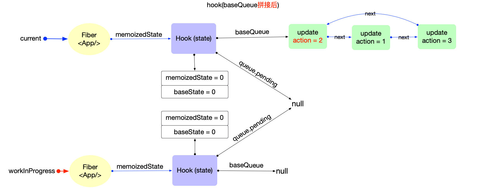
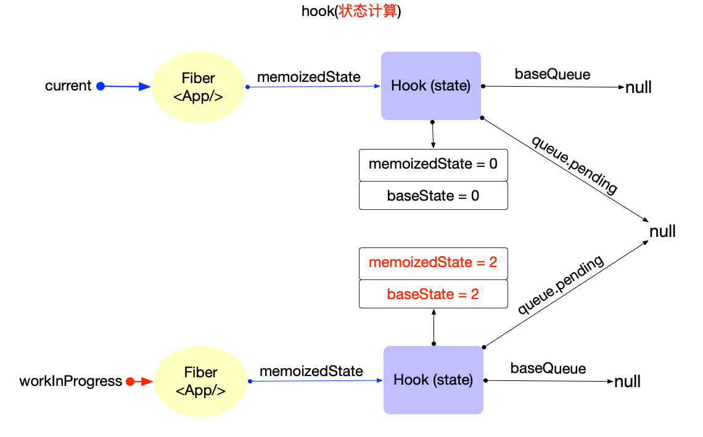

## 1. Fiber mount 阶段

`useState` 对应源码 `mountState`，`useReducer` 对应源码 `mountReducer`。

### 1.1 mountSate

```js
function mountState<S>(
  initialState: (() => S) | S
): [S, Dispatch<BasicStateAction<S>>] {
  // step1：创建 hook
  const hook = mountWorkInProgressHook()
  if (typeof initialState === 'function') {
    initialState = initialState()
  }
  // step2：初始化hook的属性
  // step2.1：设置 hook.memoizedState/hook.baseState
  hook.memoizedState = hook.baseState = initialState
  // step2.2：设置 hook.queue
  const queue = (hook.queue = {
    pending: null,
    dispatch: null,
    // queue.lastRenderedReducer是内置函数
    lastRenderedReducer: basicStateReducer,
    lastRenderedState: (initialState: any),
  })
  // step2.3：设置 hook.dispatch
  const dispatch: Dispatch<BasicStateAction<S>> = (queue.dispatch =
    (dispatchAction.bind(null, currentlyRenderingFiber, queue): any))

  // step3：返回 [当前状态, dispatch 函数]
  return [hook.memoizedState, dispatch]
}
```

### 1.2 mountReducer

```js
function mountReducer<S, I, A>(
  reducer: (S, A) => S,
  initialArg: I,
  init?: (I) => S
): [S, Dispatch<A>] {
  // step1：创建 hook
  const hook = mountWorkInProgressHook()
  let initialState
  if (init !== undefined) {
    initialState = init(initialArg)
  } else {
    initialState = ((initialArg: any): S)
  }
  // step2：初始化 hook 的属性
  // step2.1：设置 hook.memoizedState/hook.baseState
  hook.memoizedState = hook.baseState = initialState
  // step2.2：设置 hook.queue
  const queue = (hook.queue = {
    pending: null,
    dispatch: null,
    // queue.lastRenderedReducer是由外传入
    lastRenderedReducer: reducer,
    lastRenderedState: (initialState: any),
  })
  // step2.3：设置 hook.dispatch
  const dispatch: Dispatch<A> = (queue.dispatch = (dispatchAction.bind(
    null,
    currentlyRenderingFiber,
    queue
  ): any))

  // step3：返回 [当前状态, dispatch 函数]
  return [hook.memoizedState, dispatch]
}
```

### 1.3 总结

`mountState` 和 `mountReducer` 逻辑简单：主要负责创建 hook，初始化 hook 的属性，最后返回 [当前状态, dispatch 函数]。

唯一的不同点是 `hook.queue.lastRenderedReducer`：

- `mountState` 使用的是内置的 `basicStateReducer`
  ```js
  function basicStateReducer<S>(state: S, action: BasicStateAction<S>): S {
    return typeof action === 'function' ? action(state) : action
  }
  ```
- `mountReducer` 使用的是外部传入自定义 `reducer`

> 可见 `mountState` 是 `mountReducer` 的一种特殊情况，即 `useState` 也是 `useReducer` 的一种特殊情况，也是最简单的情况。

```js
/** useState 可以转换成 useReducer： **/
const [state, dispatch] = useState({ count: 0 })

// 等价于
const [state, dispatch] = useReducer(
  function basicStateReducer(state, action) {
    return typeof action === 'function' ? action(state) : action
  },
  { count: 0 }
)

// 当需要更新 state 时, 有 2 种方式
// 1.直接设置
dispatch({ count: 1 })
// 2.通过回调函数设置
dispatch((state) => ({ count: state.count + 1 }))
```

> `useState` 就是对 `useReducer` 的基本封装，内置了一个特殊的 `reducer`。创建 hook 之后返回值 [`hook.memoizedState`, `dispatch`] 中的 `dispatch` 实际上会调用 `reducer` 函数。

#### 1.3.1 状态初始化

在 `useState(initialState)` 函数内部，设置 `hook.memoizedState = hook.baseState = initialState`，初始状态被同时保存到了 `hook.baseState`，`hook.memoizedState` 中。

- `hook.memoizedState`：当前状态。
- `hook.baseState`：基础状态, 作为合并 `hook.baseQueue` 的初始值。

最后返回 [`hook.memoizedState`, `dispatch`]，所以在 function 中使用的是 `hook.memoizedState`。

## 2. Fiber update 阶段

一个例子：

```jsx
import { useState } from 'react'

export default function App() {
  const [count, dispatch] = useState(0)
  return (
    <button
      onClick={() => {
        dispatch(1)
        dispatch(3)
        dispatch(2)
      }}
    >
      {count}
    </button>
  )
}
```

初次渲染时`count = 0`，这时 hook 对象的内存状态如下：


点击 `button`，通过 `dispatch` 函数进行更新，`dispatch` 实际就是 `dispatchAction`：

```js
function dispatchAction<S, A>(
  fiber: Fiber,
  queue: UpdateQueue<S, A>,
  action: A
) {
  // step1：创建 update 对象
  const eventTime = requestEventTime()
  // Legacy模式返回SyncLane
  const lane = requestUpdateLane(fiber)
  const update: Update<S, A> = {
    lane,
    action,
    eagerReducer: null,
    eagerState: null,
    next: (null: any),
  }

  // step2：将 update 对象添加到 hook.queue.pending 队列
  const pending = queue.pending
  if (pending === null) {
    // 首个update, 创建一个环形链表
    update.next = update
  } else {
    update.next = pending.next
    pending.next = update
  }
  queue.pending = update

  const alternate = fiber.alternate
  if (
    fiber === currentlyRenderingFiber ||
    (alternate !== null && alternate === currentlyRenderingFiber)
  ) {
    // 渲染时更新, 做好全局标记
    didScheduleRenderPhaseUpdateDuringThisPass =
      didScheduleRenderPhaseUpdate = true
  } else {
    // ...省略性能优化部分

    // step3：发起调度更新, 进入`reconciler 运作流程`中的输入阶段.
    scheduleUpdateOnFiber(fiber, lane, eventTime)
  }
}
```

代码逻辑介绍：

1. 创建`update`对象，其中`update.lane`代表优先级。
2. 将`update`对象添加到`hook.queue.pending`环形链表。
   - **环形链表的特征**：为了方便添加新元素和快速拿到队首元素（都是 O(1)），所以 `pending` 指针指向了链表中最后一个元素。
3. 发起调度更新：调用`scheduleUpdateOnFiber`，进入 `reconciler` 运作流程中的输入阶段。

> 上述例子中虽然同时执行了 3 次 `dispatch`，会请求 3 次调度，由于调度中心的 **节流优化**，最后只会执行一次渲染。

### 2.1 updateState

```js
function updateState<S>(
  initialState: (() => S) | S
): [S, Dispatch<BasicStateAction<S>>] {
  return updateReducer(basicStateReducer, (initialState: any))
}
```

在执行 `updateReducer` 之前，hook 相关的内存结构如下：


### 2.2 updateReducer

```js
function updateReducer<S, I, A>(
  reducer: (S, A) => S,
  initialArg: I,
  init?: (I) => S
): [S, Dispatch<A>] {
  // step1：获取 workInProgressHook 对象
  const hook = updateWorkInProgressHook()
  const queue = hook.queue
  queue.lastRenderedReducer = reducer
  const current: Hook = (currentHook: any)
  let baseQueue = current.baseQueue

  // step2：链表拼接 - 将 hook.queue.pending 拼接到 current.baseQueue
  const pendingQueue = queue.pending
  if (pendingQueue !== null) {
    if (baseQueue !== null) {
      const baseFirst = baseQueue.next
      const pendingFirst = pendingQueue.next
      baseQueue.next = pendingFirst
      pendingQueue.next = baseFirst
    }
    current.baseQueue = baseQueue = pendingQueue
    queue.pending = null
  }
  // step3：状态计算
  if (baseQueue !== null) {
    const first = baseQueue.next
    let newState = current.baseState

    let newBaseState = null
    let newBaseQueueFirst = null
    let newBaseQueueLast = null
    let update = first

    do {
      const updateLane = update.lane
      // step3.1：优先级提取 update
      if (!isSubsetOfLanes(renderLanes, updateLane)) {
        // 优先级不够: 加入到 baseQueue 中, 等待下一次 render
        const clone: Update<S, A> = {
          lane: updateLane,
          action: update.action,
          eagerReducer: update.eagerReducer,
          eagerState: update.eagerState,
          next: (null: any),
        }
        if (newBaseQueueLast === null) {
          newBaseQueueFirst = newBaseQueueLast = clone
          newBaseState = newState
        } else {
          newBaseQueueLast = newBaseQueueLast.next = clone
        }
        currentlyRenderingFiber.lanes = mergeLanes(
          currentlyRenderingFiber.lanes,
          updateLane
        )
        markSkippedUpdateLanes(updateLane)
      } else {
        // 优先级足够: 状态合并
        if (newBaseQueueLast !== null) {
          // 更新 baseQueue
          const clone: Update<S, A> = {
            lane: NoLane,
            action: update.action,
            eagerReducer: update.eagerReducer,
            eagerState: update.eagerState,
            next: (null: any),
          }
          newBaseQueueLast = newBaseQueueLast.next = clone
        }
        if (update.eagerReducer === reducer) {
          // 性能优化: 如果存在 update.eagerReducer, 直接使用update.eagerState.避免重复调用reducer
          newState = ((update.eagerState: any): S)
        } else {
          const action = update.action
          // 调用 reducer 获取最新状态
          newState = reducer(newState, action)
        }
      }
      update = update.next
    } while (update !== null && update !== first)

    // step3.2：更新属性
    if (newBaseQueueLast === null) {
      newBaseState = newState
    } else {
      newBaseQueueLast.next = (newBaseQueueFirst: any)
    }
    if (!is(newState, hook.memoizedState)) {
      markWorkInProgressReceivedUpdate()
    }
    // 把计算之后的结果更新到 workInProgressHook 上
    hook.memoizedState = newState
    hook.baseState = newBaseState
    hook.baseQueue = newBaseQueueLast
    queue.lastRenderedState = newState
  }

  const dispatch: Dispatch<A> = (queue.dispatch: any)
  return [hook.memoizedState, dispatch]
}
```

`updateReducer` 函数逻辑如下：

- 调用 `updateWorkInProgressHook` 获取 `workInProgressHook` 对象。
- 链表拼接: 将 `hook.queue.pending` 拼接到 `current.baseQueue`
  - 
- 状态计算
  - `update` 优先级不够：加入到 `baseQueue` 中, 等待下一次 `render`。
  - `update` 优先级足够：状态合并。
  - 更新属性。
    - 
