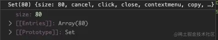
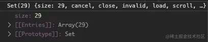
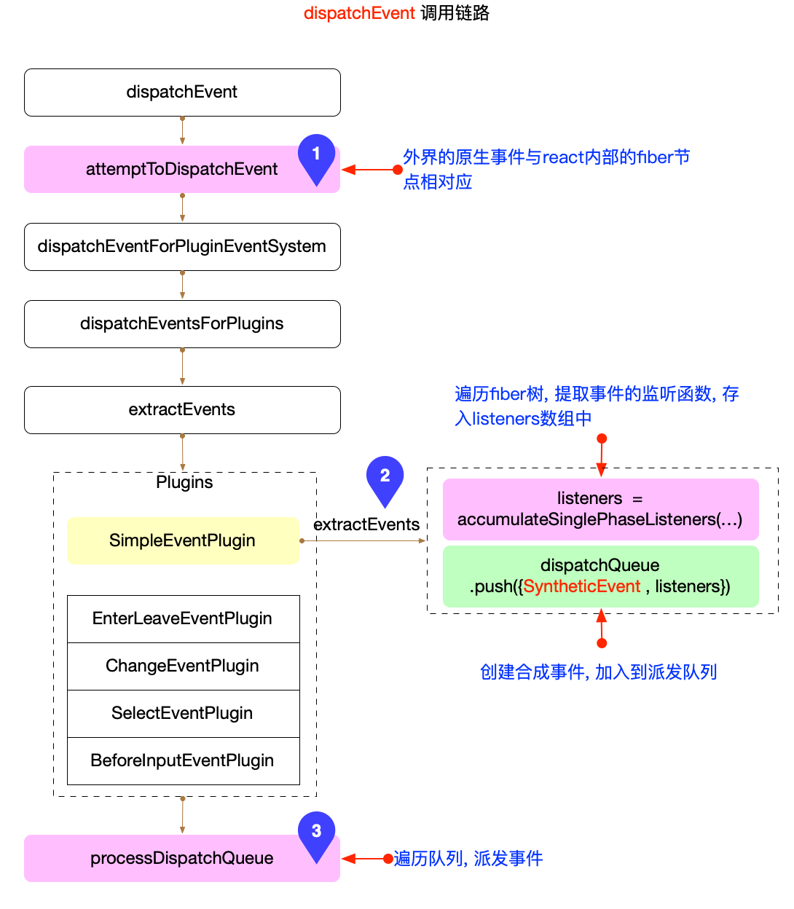

## 1. 事件注册

事件注册是在顶层自执行的，在 React 自身引入文件的时候调用的。

注册事件（React 将同种类型的事件放在一个插件中）：

```js
import * as BeforeInputEventPlugin from './plugins/BeforeInputEventPlugin'
import * as ChangeEventPlugin from './plugins/ChangeEventPlugin'
import * as EnterLeaveEventPlugin from './plugins/EnterLeaveEventPlugin'
import * as SelectEventPlugin from './plugins/SelectEventPlugin'
import * as SimpleEventPlugin from './plugins/SimpleEventPlugin'

// 原生 DOM 事件名称与 React 事件名称映射关系。
// 其中一个作用就是给 allNativeEvents 注入所有原生事件名，下文会用到
SimpleEventPlugin.registerEvents()
EnterLeaveEventPlugin.registerEvents()
ChangeEventPlugin.registerEvents()
SelectEventPlugin.registerEvents()
BeforeInputEventPlugin.registerEvents()
```

`registerEvents` 用于初始化原生事件（其中一个作用是为 `allNativeEvents` 集合注入原生事件名）

> 插件说明
>
> - SimpleEventPlugin：处理常见的 DOM 事件
> - EnterLeaveEventPlugin：处理鼠标进入离开时事件
> - ChangeEventPlugin：处理表单元素上的 onChange 事件
> - SelectEventPlugin：负责处理表单元素上的 onSelect 事件
> - BeforeInputEventPlugin：用于处理 input、textarea 或者 contentEditable 元素上的 onBeforeInput 事件

### 1.1 listenToAllSupportedEvents

在 React 初始化渲染的时候，`ReactDOM.render` 会调用函数 `listenToAllSupportedEvents` 来绑定事件

```js
function createRootImpl(container, tag, options) {
  // 在根容器上监听支持的事件
  const rootContainerElement =
    container.nodeType === COMMENT_NODE ? container.parentNode : container
  listenToAllSupportedEvents(rootContainerElement)
}

function listenToAllSupportedEvents(rootContainerElement) {
  if (!rootContainerElement[listeningMarker]) {
    // allNativeEvents 是一个 Set 集合，保存所有浏览器原生事件名
    allNativeEvents.forEach((domEventName) => {
      // 判断是否支持冒泡的事件，不支持的话无需事件委托到根节点
      if (!nonDelegatedEvents.has(domEventName)) {
        // 冒泡阶段绑定事件
        listenToNativeEvent(domEventName, false, rootContainerElement, null)
      }
      // 捕获阶段绑定事件
      listenToNativeEvent(domEventName, true, rootContainerElement, null)
    })
  }
}
```

> `listenToAllSupportedEvents` 的核心逻辑：
>
> - 通过 `listenToNativeEvent` 来绑定浏览器事件，且绑定在 `rootContainerElement` 根节点。
> - 如果是支持冒泡的事件，则捕获阶段和冒泡阶段都绑定事件；不支持冒泡的事件，则只绑定捕获阶段的事件。
>   - allNativeEvents：是一个 Set 集合，保存了 80 个浏览器原生 DOM 事件。
>     - `allNativeEvents: Set<DOMEventName> = new Set(); ` > 
>   - nonDelegatedEvents：Set 集合，保存浏览器原生事件中不会冒泡的事件，如 load，scroll，媒体事件 canplay，play 等等。
>     - `nonDelegatedEvents: Set<DOMEventName> = new Set([ 'cancel', 'close', ..., ...mediaEventTypes ]);` > 

### 1.2 listenToNativeEvent

```js
function listenToNativeEvent(
  domEventName,
  isCapturePhaseListener,
  rootContainerElement,
  targetElement,
  eventSystemFlags
) {
  // 绑定事件
  addTrappedEventListener(
    target,
    domEventName,
    eventSystemFlags,
    isCapturePhaseListener
  )
}

function addTrappedEventListener(
  targetContainer,
  domEventName,
  eventSystemFlags,
  isCapturePhaseListener,
  isDeferredListenerForLegacyFBSupport
) {
  // 创建事件委托的回调函数（其实是事件派发器）
  let listener = createEventListenerWrapperWithPriority(
    targetContainer,
    domEventName,
    eventSystemFlags
  )
  // 根据事件是捕获阶段还是冒泡阶段，调用不同的绑定函数
  if (isCapturePhaseListener) {
    unsubscribeListener = addEventCaptureListener(
      targetContainer,
      domEventName,
      listener
    )
  } else {
    unsubscribeListener = addEventBubbleListener(
      targetContainer,
      domEventName,
      listener
    )
  }
}

// 表示在冒泡阶段触发事件处理函数
function addEventBubbleListener(target, eventType, listener) {
  // 第三个参数为 false（冒泡阶段）
  // 需要注意这里的 listener 是事件派发器，并不是我们自己使用时写的事件回调
  target.addEventListener(eventType, listener, false)
  return listener
}

// 表示在捕获阶段触发事件处理函数
function addEventCaptureListener(target, eventType, listener) {
  // 第三个参数为 true（捕获阶段）
  target.addEventListener(eventType, listener, true)
  return listener
}
```

> `listenToNativeEvent` 的核心逻辑：
>
> - 创建事件委托的回调函数。
> - 根据事件是捕获阶段还是冒泡阶段，调用不同的事件绑定函数。

### 1.3 createEventListenerWrapperWithPriority

```js
export function createEventListenerWrapperWithPriority(
  targetContainer,
  domEventName,
  eventSystemFlags
) {
  // 根据事件名获取事件的优先级
  const eventPriority = getEventPriorityForPluginSystem(domEventName)

  let listenerWrapper
  // 根据事件优先级返回对应的事件监听函数
  switch (eventPriority) {
    // 离散事件
    case DiscreteEvent: // 优先级最高
      listenerWrapper = dispatchDiscreteEvent
      break
    // 用户交互阻塞渲染的事件
    case UserBlockingEvent: // 优先级适中
      listenerWrapper = dispatchUserBlockingUpdate
      break
    // 其它事件
    case ContinuousEvent: // 优先级最低
    default:
      listenerWrapper = dispatchEvent
      break
  }
  // 返回事件回调函数 listener
  return listenerWrapper.bind(
    null,
    domEventName,
    eventSystemFlags,
    targetContainer
  )
}
```

由上述代码可以看出，不同的 `DOM` 事件调用 `getEventPriorityForPluginSystem` 会返回不同的优先级，优先级包括：

- `DiscreteEvent`：离散事件。如 `click`、`keydown`、`focusin`等，这些事件的触发不是连续的，可以快速响应，优先级最高。
- `UserBlockingEvent`：用户交互阻塞渲染的事件。如 `drag`、`scroll` 等，优先级适中。
- `ContinuousEvent` 与 `default`：连续事件和默认事件。连续事件如 `playing`、`load` 等，优先级最低。

> 而前两个对应的 `dispatchDiscreteEvent` 和 `dispatchUserBlockingUpdate` 其实都是对 `dispatchEvent` 的封装。

### 1.4 总结

1. React 初始化时，会在根节点上绑定原生事件
2. 支持冒泡的事件，React 会同时绑定捕获阶段和冒泡阶段的事件；
3. 不支持冒泡的事件，React 则只绑定捕获阶段的事件
   - 对不支持冒泡的事件，React 在 DOM 实例的创建阶段（completeWork），React 会直接把事件绑定在具体的元素上
4. React 将事件分为三种优先级类型，在绑定事件处理函数时会使用不同的回调函数，但底层都是调用 dispatchEvent 函数

## 2. 事件触发

当 `DOM` 事件触发之后, 会进入到 `dispatchEvent` 这个回调函数，里面会调用 `attemptToDispatchEvent` 这个方法，作用是尝试调度事件

```js
function dispatchEvent(
  domEventName,
  eventSystemFlags,
  targetContainer,
  nativeEvent
) {
  // ...
  // 尝试派发事件
  const blockedOn = attemptToDispatchEvent(
    domEventName,
    eventSystemFlags,
    targetContainer,
    nativeEvent
  )

  // 尝试派发事件成功，则 return， 下方的代码无需执行
  if (blockedOn === null) {
    // ...
    return
  }

  // 派发事件
  dispatchEventForPluginEventSystem(
    domEventName,
    eventSystemFlags,
    nativeEvent,
    null,
    targetContainer
  )
}
```

`dispatchEvent` 函数是 React 事件体系中最关键的函数, 其调用链路较长, 核心步骤如图所示:



> **重点关注其中 3 个核心环节:**
>
> - attemptToDispatchEvent
> - SimpleEventPlugin.extractEvents
> - processDispatchQueue

### 2.1 attemptToDispatchEvent

```js
function attemptToDispatchEvent(
  domEventName,
  eventSystemFlags,
  targetContainer,
  nativeEvent
) {
  // 获取触发事件的 DOM 元素（即获取 nativeEvent.target 属性）
  const nativeEventTarget = getEventTarget(nativeEvent) // nativeEvent 是原生事件对象
  // 根据该 DOM 元素对应的 fiber 节点
  let targetInst = getClosestInstanceFromNode(nativeEventTarget)

  // ...

  // 通过插件系统，派发事件
  dispatchEventForPluginEventSystem(
    domEventName,
    eventSystemFlags,
    nativeEvent,
    targetInst,
    targetContainer
  )
}
```

> `attemptToDispatchEvent` 的核心逻辑：
>
> - 获取触发事件的 `DOM` 元素。
> - 根据该 `DOM` 元素对应的 `fiber` 节点。
> - 通过事件插件系统，派发事件。

### 2.2 dispatchEventForPluginEventSystem

```js
function dispatchEventForPluginEventSystem(
  domEventName,
  eventSystemFlags,
  nativeEvent,
  targetInst,
  targetContainer
) {
  // 打开批处理
  batchedEventUpdates(() =>
    dispatchEventsForPlugins(
      domEventName,
      eventSystemFlags,
      nativeEvent,
      ancestorInst,
      targetContainer
    )
  )
}

function dispatchEventsForPlugins(
  domEventName,
  eventSystemFlags,
  nativeEvent,
  targetInst,
  targetContainer
) {
  // 获取触发事件的 DOM 元素（即获取 nativeEvent.target 属性）
  const nativeEventTarget = getEventTarget(nativeEvent)
  // 初始化事件派发队列，用于储存 listener
  const dispatchQueue = []
  // 1. 创建合成事件，并收集同类型事件添加到 dispatchQueue 中
  extractEvents(
    dispatchQueue,
    domEventName,
    targetInst,
    nativeEvent,
    nativeEventTarget,
    eventSystemFlags,
    targetContainer
  )
  // 2. 根据事件派发队列执行事件派发
  processDispatchQueue(dispatchQueue, eventSystemFlags)
}
```

> `dispatchEventForPluginEventSystem` 的核心逻辑：
>
> - 创建合成事件，并收集同类型事件添加到 `dispatchQueue` 中。
> - 根据事件派发队列执行事件派发。

### 2.3 合成事件

#### 2.3.1 extractEvents

```js
function extractEvents(dispatchQueue, domEventName, targetInst, nativeEvent, nativeEventTarget, eventSystemFlags, targetContainer) {
  SimpleEventPlugin.extractEvents(
    dispatchQueue,
    domEventName,
    targetInst,
    nativeEvent,
    nativeEventTarget,
    eventSystemFlags,
    targetContainer,
  );
  const shouldProcessPolyfillPlugins =
    (eventSystemFlags & SHOULD_NOT_PROCESS_POLYFILL_EVENT_PLUGINS) === 0;
  if (shouldProcessPolyfillPlugins) {
    EnterLeaveEventPlugin.extractEvents(...)
    ChangeEventPlugin.extractEvents(...)
    SelectEventPlugin.extractEvents(...)
    BeforeInputEventPlugin.extractEvents(...)
  }
}
```

在合成事件中，会根据 `domEventName` 来决定使用哪种类型的合成事件。

#### 2.3.2 SimpleEventPlugin.extractEvents

`SimpleEventPlugin` 提供了 React 事件系统的基本功能，以 `SimpleEventPlugin.extractEvents` 为例：

```js
function extractEvents(
  dispatchQueue: DispatchQueue,
  domEventName: DOMEventName,
  targetInst: null | Fiber,
  nativeEvent: AnyNativeEvent,
  nativeEventTarget: null | EventTarget,
  eventSystemFlags: EventSystemFlags,
  targetContainer: EventTarget
): void {
  // 根据原生事件名得到 React 事件名
  const reactName = topLevelEventsToReactNames.get(domEventName)
  // 合成事件实例
  let SyntheticEventCtor = SyntheticEvent
  // switch (domEventName) // 不同事件名
  // SyntheticEventCtor = xxx // 赋予相应的合成事件构造函数

  // 收集节点上所有监听该事件的 listener，向上遍历直到根节点
  // 通过 Fiber 中的 return 属性依次遍历父节点的 props 属性，收集相同 react 事件
  const listeners = accumulateSinglePhaseListeners(
    targetInst,
    reactName,
    nativeEvent.type,
    inCapturePhase,
    accumulateTargetOnly
  )
  if (listeners.length > 0) {
    const event = new SyntheticEventCtor(
      reactName,
      reactEventType,
      null,
      nativeEvent,
      nativeEventTarget
    )
    // 往事件派发队列添加事件（注入合成事件实例与同类型事件监听数组）
    dispatchQueue.push({ event, listeners })
  }
}
```

> `SimpleEventPlugin.extractEvents` 的核心逻辑：
>
> - 根据原生事件名得到 React 事件名。
> - 不同事件名，赋予相应的合成事件构造函数。
> - 收集节点上所有监听该事件的 listener，向上遍历直到根节点。
> - 实例化合成事件，并往事件派发队列添加事件（注入合成事件实例与同类型事件监听数组）。

#### 2.3.3 SyntheticEventCtor

```js
export const SyntheticEvent = createSyntheticEvent(EventInterface)

// 不同事件类型不同的 Interface
function createSyntheticEvent(Interface) {
  function SyntheticBaseEvent(
    reactName,
    reactEventType,
    targetInst,
    nativeEvent,
    nativeEventTarget
  ) {
    this.isPropagationStopped = functionThatReturnsFalse
    // ...

    // 在合成事件构造函数的原型上添加
    Object.assign(SyntheticBaseEvent.prototype, {
      // 阻止默认事件
      preventDefault: function () {
        if (event.preventDefault) {
          event.preventDefault()
        }
        this.isDefaultPrevented = functionThatReturnsTrue
      },
      // 阻止冒泡
      stopPropagation: function () {
        if (event.stopPropagation) {
          event.stopPropagation()
        }
        this.isPropagationStopped = functionThatReturnsTrue
      },
      // 17 版本去除了事件池，persist 和 isPersistent 都没有用了，但为了向下兼容保留
      persist: function () {
        // Modern event system doesn't use pooling.
      },
      isPersistent: functionThatReturnsTrue,
    })
  }
  return SyntheticBaseEvent
}

function functionThatReturnsTrue() {
  return true
}
```

> 在 React 事件使用的 `e.preventDefault` 和 `e.stopPropagation` 都是 React 重写封装的，而且是写在合成对象构造函数原型上，且同类型的事件会复用同一个合成事件实例对象。

### 2.4 事件派发

#### 2.4.1 processDispatchQueue

```js
function processDispatchQueue(dispatchQueue, eventSystemFlags) {
  // 是否是捕获阶段，关系到后面执行的顺序
  const inCapturePhase = (eventSystemFlags & IS_CAPTURE_PHASE) !== 0
  // 循环收集的事件数组
  for (let i = 0; i < dispatchQueue.length; i++) {
    const { event, listeners } = dispatchQueue[i]
    processDispatchQueueItemsInOrder(event, listeners, inCapturePhase)
  }
}
```

`processDispatchQueue` 函数：遍历 `dispatchQueue` 数组 ，调用 `processDispatchQueueItemsInOrder` 函数派发事。

#### 2.4.2 processDispatchQueueItemsInOrder

```js
function processDispatchQueueItemsInOrder(
  event,
  dispatchListeners,
  inCapturePhase
) {
  let previousInstance
  if (inCapturePhase) {
    // 捕获阶段，倒序遍历
    for (let i = dispatchListeners.length - 1; i >= 0; i--) {
      const { instance, currentTarget, listener } = dispatchListeners[i]
      // 判断当前是否已停止冒泡了，是则直接 return
      // 如果 e.stopPropagation() 方法被调用过，则会一直返回 true，否则默认一直返回 false
      if (instance !== previousInstance && event.isPropagationStopped()) {
        return
      }
      executeDispatch(event, listener, currentTarget)
      previousInstance = instance
    }
  } else {
    // 冒泡阶段，顺序遍历
    for (let i = 0; i < dispatchListeners.length; i++) {
      const { instance, currentTarget, listener } = dispatchListeners[i]
      if (instance !== previousInstance && event.isPropagationStopped()) {
        return
      }
      executeDispatch(event, listener, currentTarget)
      previousInstance = instance
    }
  }
}

function executeDispatch(
  event: ReactSyntheticEvent,
  listener: Function,
  currentTarget: EventTarget
): void {
  event.currentTarget = currentTarget
  try {
    listener(event)
  } catch (error) {
    reportGlobalError(error)
  }
  event.currentTarget = null
}
```

> `processDispatchQueueItemsInOrder` 的核心逻辑：
>
> - 收集 `dispatchListeners` 时，是从当前 `Fiber` 节点遍历至根节点，所以可理解顺序遍历就是冒泡的顺序。
> - 根据事件阶段（冒泡或捕获）来决定是顺序还是倒序遍历合成事件中的 `listeners`。
>   - 捕获阶段是从上往下调用 `Fiber` 树中绑定的回调函数，所以倒序遍历。
>   - 而冒泡阶段是从下往上调用 `Fiber` 中的回调函数，所以是顺序遍历。
> - 最后执行 `executeDispatch` 真正派发了事件，在 `Fiber` 节点上绑定的 `listener` 也就被执行了。
> - React 模拟原生事件捕获与冒泡的执行顺序，本质是靠向上搜集事件后，控制事件的遍历顺序去模拟的。

### 2.5 总结

1. 在触发事件之前，React 会根据当前实际触发事件的 `DOM` 元素找到其 `Fiber` 节点，向上收集同类型事件添加到事件队列中。
2. 根据事件阶段（冒泡/捕获），来决定（顺序/倒序）遍历执行事件函数。
3. 当调用 React 阻止冒泡方法时，就是把变量 `isPropagationStopped` 设置为一个返回 `true` 的函数，后续派发事件时只要代码判断时则执行函数结果为 true 则表示阻止冒泡，就不再走下面逻辑。
