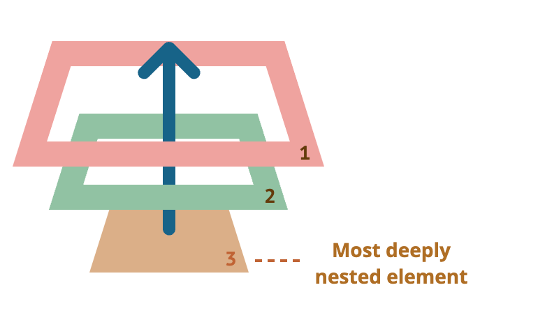
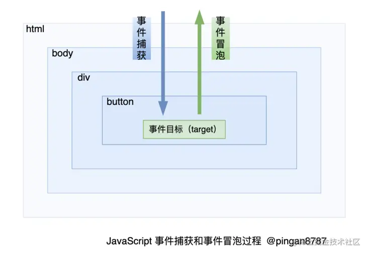
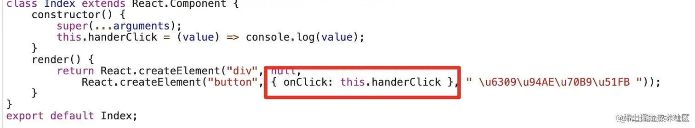
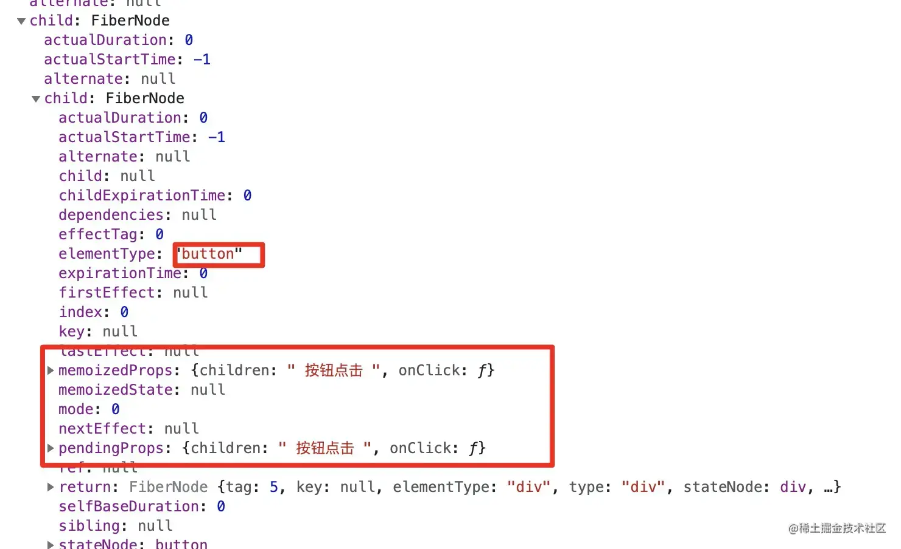
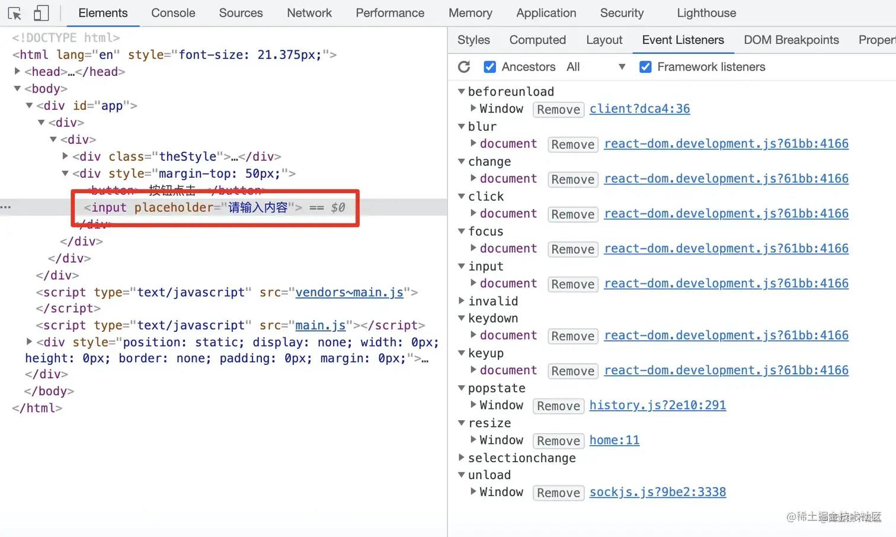
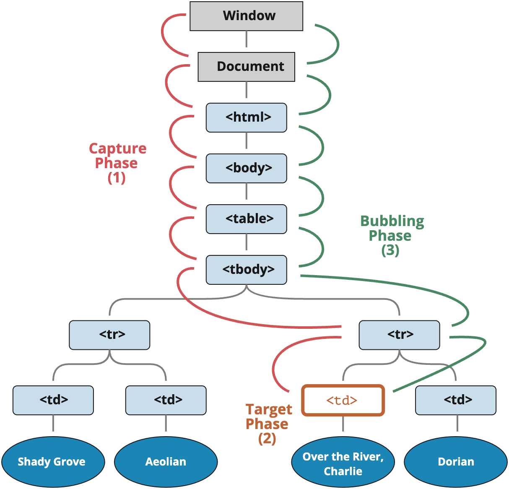
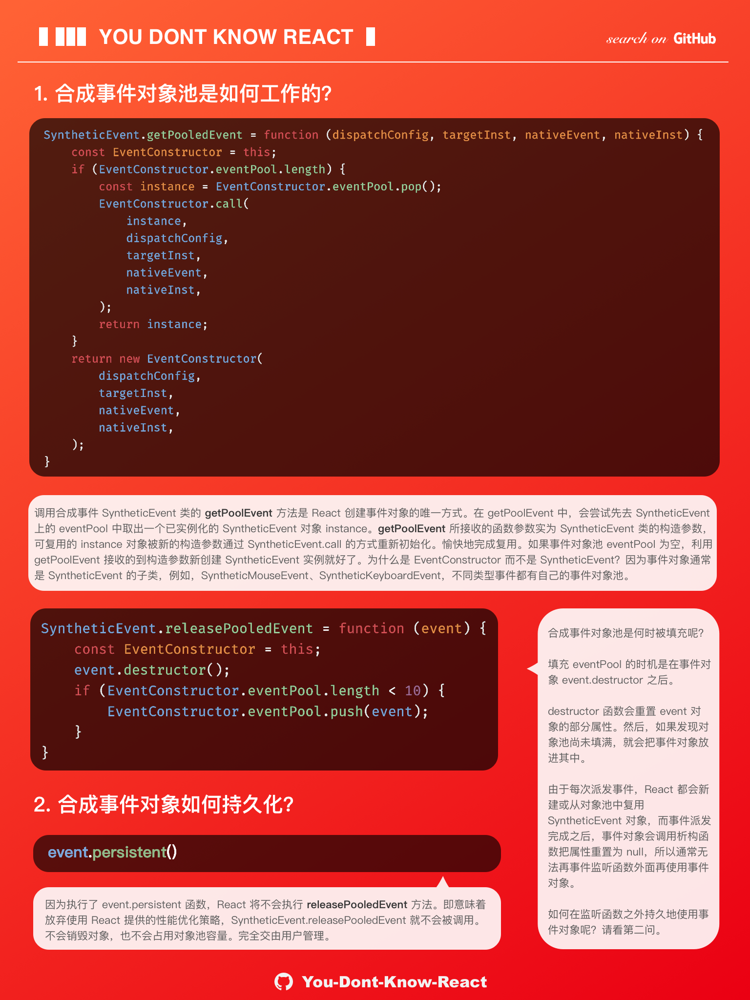
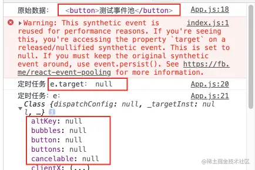
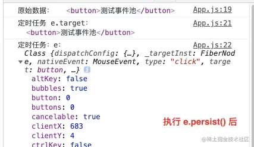
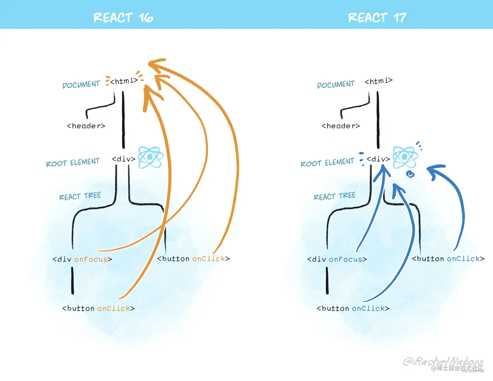

## 1. 原生事件

一个简单的例子

```html
<div onclick="alert('The handler!')">
  <ul>
    <li>Coffee</li>
    <li>Tea</li>
    <li>Milk</li>
  </ul>
</div>
```

> 无论点击 Coffee、Tea 或 Milk 都会触发 div 上面绑定的 onclick 逻辑

实际上点击的是 `<li>`，但为什么在 `<div>` 上的处理程序会运行？

### 1.1 事件冒泡

**当一个事件发生在一个元素上，它会首先运行在该元素上的处理程序，然后运行其父元素上的处理程序，然后一直向上到其他祖先上的处理程序。**

一个例子

```html
<div onclick="alert('div-1')">
  div-1
  <div onclick="alert('div-2')">
    div-2
    <div onclick="alert('div-3')">div-3</div>
  </div>
</div>
```

> 如果我们点击最内部 `<div>`，那么我们将看到 3 个 alert：div-3 → div-2 → div-1



这个过程被称为“冒泡（bubbling）”，因为事件从内部元素“冒泡”到所有父级，**就像在水里的气泡一样。**

### 1.2 事件捕获

**当元素被触发事件时候，从该元素的根节点开始逐级向里寻找同类型事件。这个过程，就被称为事件捕获。**

一个例子

```html
<form onclick="alert('div-1')">
  form
  <div onclick="alert('div-2')">
    div
    <p onclick="alert('div-3')">p</p>
  </div>
</form>
```

> 如果我们点击最内部 `<div>`，事件首先通过祖先链向下到达元素 **（捕获阶段）**，然后到达目标 **（目标阶段）**，最后上升 **（冒泡阶段）**，在途中调用处理程序。



**事件捕获** 刚好就和 **事件冒泡** 反过来。

### 1.3 事件代理/事件委托

> 简单理解就是将一个响应事件委托到另一个元素。

当子节点被点击时，事件向上冒泡，父节点捕获到事件后，我们判断是否为所需的节点，然后进行处理。 **其优点在于减少内存消耗和动态绑定事件。**

## 2. React 事件机制

React 自身实现了一套自己的事件机制，包括事件注册、事件的合成、事件冒泡、事件派发等，虽然和原生的是两码事，但也是 **基于浏览器的事件机制下完成的。**

React 的所有事件并没有绑定到具体的 `DOM` 节点上而是绑定在了 `document` 上，然后由统一的事件处理程序来处理，同时也是基于浏览器的事件机制（冒泡），所有节点的事件都会在 `document` 上触发。

### 2.1 事件解析

```js
class Index extends React.Component {
  handerClick = (value) => console.log(value)
  render() {
    return (
      <div>
        <button onClick={this.handerClick}> 按钮点击 </button>
      </div>
    )
  }
}
```

经过 babel 转换成 React.createElement 形式，如下：



> 事件通过 props 的形式传入 React.createElement 方法中

最终得到的 fiber 的对象形式，如下：



> fiber 对象上的 memoizedProps 和 pendingProps 保存了相关事件。

### 2.2 事件绑定

一个简单的例子，如下：

```js
class Index extends React.Component {
  componentDidMount() {
    console.log(this)
  }
  handerClick = (value) => console.log(value)
  handerChange = (value) => console.log(value)
  render() {
    return (
      <div style={{ marginTop: '50px' }}>
        <button onClick={this.handerClick}> 按钮点击 </button>
        <input placeholder="请输入内容" onChange={this.handerChange} />
      </div>
    )
  }
}
```

从浏览器中看事件绑定



我们给 `<input>` 标签绑定的 `onChange` 事件，并没有直接绑定在 `<input>` 上，而是统一绑定在了 `document` 上，然后我们 `onChange` 被处理成很多事件监听器，比如 `blur`，`change`，`input`，`keydown`，`keyup` 等。

**综上我们可以得出结论：**

- 我们在 `jsx` 中绑定的事件，根本就没有注册到真实的 `DOM` 上。是绑定在 `document` 上统一管理的。
- 真实的 `DOM` 上的 `click` 事件被单独处理，已经被 React 底层替换成空函数。
- 我们在 React 绑定的事件,比如 `onChange`，在 `document` 上，可能有多个事件与之对应。
- React 并不是一开始，把所有的事件都绑定在 `document` 上，而是采取了一种按需绑定，比如发现了 `onClick` 事件，再去绑定 `document click` 事件。

### 2.3 执行顺序

React 事件和原生事件的执行顺序是如何的呢？

DOM 事件标准描述了事件传播的 3 个阶段，如下：



- 捕获阶段（Capturing phase）—— 事件（从 Window）向下走近元素。
- 目标阶段（Target phase）—— 事件到达目标元素。
- 冒泡阶段（Bubbling phase）—— 事件从元素上开始冒泡。

由于 React 合成事件的触发是基于浏览器的事件机制来实现的，通过冒泡机制冒泡到最顶层元素，然后再由 `dispatchEvent` 统一去处理。

**综上我们可以得出结论：**

- 优先处理 `DOM` 原生事件优先触发，后处理 React 事件，最后执行 `document` 上挂载的事件。
- 原生事件阻止冒泡肯定会阻止合成事件的触发。
- 合成事件的阻止冒泡不会影响原生事件。

> React 自己做这么多的意义是什么？
>
> - 减少内存消耗，提升性能，不需要注册那么多的事件了，一种事件类型只在 document 上注册一次。
> - 统一规范，解决 ie 事件兼容问题，简化事件逻辑。
> - 对开发者友好。

### 2.4 合成事件与原生事件区别

#### 2.4.1 事件名称命名方式不同

原生事件命名为纯小写，而 React 事件命名采用小驼峰式，如下所示：

```js
// 原生事件绑定方式
;<button onclick="handleClick()">Leo 按钮命名</button>

// React 合成事件绑定方式
const button = <button onClick={handleClick}>Leo 按钮命名</button>
```

#### 2.4.2 事件处理函数写法不同

原生事件中事件处理函数为字符串，在 React JSX 语法中，传入一个函数作为事件处理函数，如下所示：

```js
// 原生事件 事件处理函数写法
;<button onclick="handleClick()">Leo 按钮命名</button>

// React 合成事件 事件处理函数写法
const button = <button onClick={handleClick}>Leo 按钮命名</button>
```

#### 2.4.3 阻止默认行为方式不同

在原生事件中，可以通过返回 `false` 方式来阻止默认行为，但是在 React 中，需要显式使用 `preventDefault()` 方法来阻止，如下所示：

```js
// 原生事件阻止默认行为方式
;<a
  href="https://www.pingan8787.com"
  onclick="console.log('Leo 阻止原生事件~'); return false"
>
  Leo 阻止原生事件
</a>

// React 事件阻止默认行为方式
const handleClick = (e) => {
  e.preventDefault()
  console.log('Leo 阻止原生事件~')
}
const clickElement = (
  <a href="https://www.pingan8787.com" onClick={handleClick}>
    Leo 阻止原生事件
  </a>
)
```

### 2.5 合成事件池

合成事件对象池，是 React 事件系统提供的一种性能优化方式。不同类型的合成事件具有不同的对象池。

- 当对象池未满时，React 创建新的事件对象，派发给组件。
- 当对象池装满时，React 从池中复用事件对象，派发给组件。



#### 2.5.1 事件池分析（React 16 版本）

```js
function handleChange(e) {
  console.log('原始数据：', e.target)
  setTimeout(() => {
    console.log('定时任务 e.target：', e.target) // null
    console.log('定时任务：e：', e)
  }, 100)
}
function App() {
  return (
    <div className="App">
      <button onClick={handleChange}>测试事件池</button>
    </div>
  )
}

export default App
```

可以看到输出：



对于一次点击事件的处理函数，在正常的函数执行上下文中打印 `e.target` 就指向了 `DOM` 元素，但是在 `setTimeout` 中打印却是 `null`，如果这不是 React 事件系统，两次打印的应该是一样的，但是为什么两次打印不一样呢？

在 React 采取了一个事件池的概念，每次我们用的事件源对象，在事件函数执行之后，可以通过 `releaseTopLevelCallbackBookKeeping` 等方法将事件源对象释放到事件池中，这样的好处每次我们不必再创建事件源对象，可以从事件池中取出一个事件源对象进行复用，在事件处理函数执行完毕后，会释放事件源到事件池中，清空属性，这就是 `setTimeout` 中打印为什么是 `null` 的原因了。

在 React 16 及之前的版本，合成事件对象的事件处理函数全部被调用之后，所有属性都会被置为  `null`。这时，如果我们需要在事件处理函数运行之后获取事件对象的属性，可以使用 React 提供的 `e.persist()` 方法，保留所有属性：

```js
// 只修改 handleChange 方法，其他不变
function handleChange(e) {
  // 只增加 persist() 执行
  e.persist()

  console.log('原始数据：', e.target)
  setTimeout(() => {
    console.log('定时任务 e.target：', e.target) // null
    console.log('定时任务：e：', e)
  }, 100)
}
```

结果如下：



#### 2.5.2 事件池分析（React 17 版本）

##### 绑定对象

事件统一绑定 `container` 上（`ReactDOM.render(app, container)`），而不是 `document` 上，这样好处是有利于微前端的，微前端一个前端系统中可能有多个应用，如果继续采取全部绑定在 `document` 上，那么可能多应用下会出现问题。



##### 对齐原生浏览器事件

React 17 中终于支持了原生捕获事件的支持， 对齐了浏览器原生标准。同时 `onScroll` 事件不再进行事件冒泡。`onFocus` 和 `onBlur` 使用原生 `focusin，` `focusout` 合成。

##### 取消事件池

取消事件池 React 17 取消事件池复用，也就解决了上述在 `setTimeout` 打印，找不到 `e.target` 的问题。
