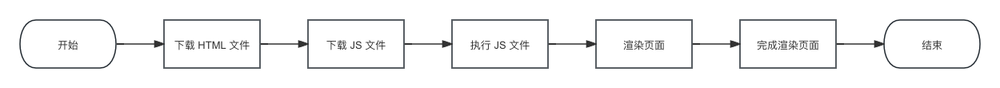
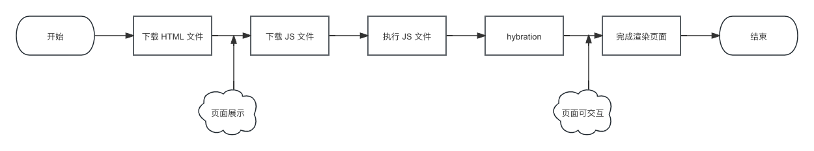
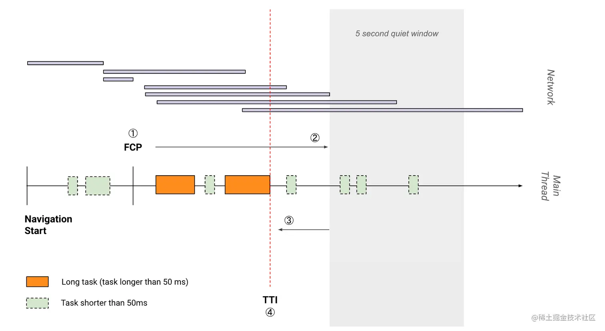

## 1. CSR

客户端渲染（Client Side Render，CSR），是指页面并不是基于服务端下发的 `HTML` 文件来渲染页面，相反，客户端渲染所获取的 `HTML` 文件，通常是一个**只有根节点的空白页面**，真正执行渲染行为的是挂载到这个 `HTML` 文件里的 `JS` 脚本。当用户打开页面的时候，浏览器会先下载一个挂满 `JS` 脚本的 `HTML` 文件，然后再去下载并执行这些 `JS` 脚本，最终通过 `JS` 脚本的代码去渲染出后续的页面元素，完成整个的渲染流程。

## 2. SSR

服务端渲染（Server Side Render，SSR），在 SSR 中，服务端会根据用户请求的路径，在服务端一侧就将完整的 `HTML` 文档拼接好，**而当前的 `HTML` 文档是具有该页面真正的内容，但是它并不具备任何交互逻辑**。同时，这个 `HTML` 文档也包含了后续需要执行的 `JS` 脚本。

当用户拿到 `HTML` 文件的时候，此时页面已经是具备可视元素的了（**相比于 CSR 的白屏**），倘若用户需要和页面进行交互的时候（例如点击事件），还需要将文档的 `JS` 脚本进行下载和执行，将正确的事件处理方法结合到对应的 `DOM` 节点上，这个过程我们通常称之为 `hydration`，也就是水合（注水）。

## 3. SSR 与 CSR 对比

### 3.1 首屏渲染速度

- 对于 `CSR` 来说，在进行 `JS` 下载和解析的过程中，页面始终是呈一个白屏状态的，如果 `JS` 的文件过大或者数量过多的话，用户侧的白屏时间会相当长，大大的降低用户的体验。

- 对于 `SSR` 来说，当用户下载完 `HTML` 文件之后，页面就已经具备了完整的可视结构了，这对于白屏来说，显然是具备更大的优势的。所以针对于 `FCP` 来说，`SSR` 的体验肯定是比 `CSR` 的要来的更加优秀一些。

### 3.2 用户可交互时间

- 对于 `CSR` 来说，当页面渲染完成之后，便是立即可交互的。
- 对于 `SSR` 来说，当页面渲染完成之后，还需要等待一个 `hydration` 的过程，直到这个过程结束之后，页面才是真正可交互的。

> `CSR` 和 `SSR` 的 `TTI` 时间大概可以总结为：
>
> - `CSR` = `HTML` 下载的时间 + `JS` 下载和执行的时间
> - `SSR` = 服务端拼接 `HTML` 的时间 + `HTML` 下载的时间 + `JS` 下载和执行的时间 + `Hydration`

### 3.3 数据请求的速度

- 在 `CSR` 的渲染方式当中，通常会在页面元素加载之前，进行一个 `AJAX` 请求，在得到返回的数据之后再进行后续的渲染。
- 在 `SSR` 当中，这个流程也是类似的。但是，虽然流程是类似的，但发出这个数据请求的环境是截然不同的：
  - 对于 `SSR` 来说，服务端的网络环境要优于客户端的环境，内部服务器之间的请求通信路径也更短。
  - 对于 `CSR` 来说，用户的网络环境具有一定的不稳定性，且每次请求都得走完完整的 `HTTP/HTTPS` 的通讯流程，显然是会更慢的。

### 3.4 SEO

`SSR` 对于 `SEO` 或者搜索引擎爬虫来说，显然是对 `CSR` 有压倒性的优势的。

> 搜索引擎优化（Search engine optimization，SEO）是透过了解搜索引擎的运作规则来调整网站，以及提高目的网站在有关搜索引擎内排名的方式。

## 4. SSR 带来的问题

### 4.1 Hybration 的性能损耗

在服务端接受到用户的请求之后，会根据路径创建出组件树，也就是**静态的进行一次页面渲染**，然后将渲染后的组件通过字符串拼接的方式返回到客户端。客户端接到 `SSR` 响应之后，为了支持恢复页面的交互功能，仍然需要创建出组件树，与 `SSR` 渲染的 `HTML` 关联起来，并绑定相关的 `DOM` 事件，让页面变得可交互，这整个过程被称为 `hydration`。`hydration` 主要解决了两个问题：

- 我们需要哪些事件处理程序？事件处理程序是一个包含事件行为的闭包。如果用户触发此事件，则应该发生这种情况。
- 我们需要将这些事件处理方法添加到哪个 `DOM` 节点？

而对于事件处理程序来说，通常内部都会对整个应用的状态进行处理，`hydration` 的过程实际上也就是利用重新执行组件代码的方法，来让静态的 `HTML` 字符串恢复这个状态。这里的状态实际上指的是两种：

- `APP_STATE`：**应用程序的状态**。简单来说应用程序的状态就是 `HTML` 事件中的各个状态事件，如果不存在这些事件状态那么所有的内容都是没有任何交互效果的。
- `FRAMEWORK_STATE`：**框架内部状态**。通常我们会利用诸如 `React` 或者 `Vue` 等框架进行接替渲染。如果没有 `FRAMETER_STATE`，框架内部就不知道应该更新哪些 `DOM` 节点，也不知道应该在什么时候更新它们。

所以，我们需要注意到，恢复 `HTML` 的交互性，或者说恢复 `HTML` 的状态实际上是一种纯粹开销的动作。**因为执行组件代码，生成组件树和对应的状态这个流程实际上在服务端已经走过一遍，只不过在下发到客户端的时候，这些信息被丢失了而已**。如果服务器将组件树的状态和交互信息以序列化的形式，将其与 `HTML` 一起发送给客户端，就可以避免发生或者延迟这个 `hydration` 的过程，新框架 `Qwik` 实际上就是这么做的。回到问题本身， **`hydration` 所需加载、执行的 `JavaScript` 代码不见得比 `CSR` 模式少多少，这部分工作在客户端执行，受限于用户设备的性能，在较差的设备下可能会造成可感知的不可交互时间**：

- `CSR`：可交互但是没有数据（还在异步请求数据，可能会持续很长）
- `SSR`：有数据但是不可交互（拉到 `JS` 后开始 `hydrate` 的过程，能看到内容但是不可交互，一般不会持续很长）

富交互的场景下，后者不一定比前者用户体验更好。

### 4.2 服务的稳定性和性能要求

与客户端程序相比，服务端程序对稳定性和性能的要求严苛得多，例如：

- 稳定性：异常崩溃、死循环
- 性能：内存/CPU 资源占用、响应速度（网络传输距离等都要考虑在内）

因此面临后端专业性问， 搭建一个高可用的 `SSR` 服务不是一件简单的事情，如何应对大流量/高并发，如何识别故障，如何降级/快速恢复，哪些环节需要加缓存，缓存如何更新等。
